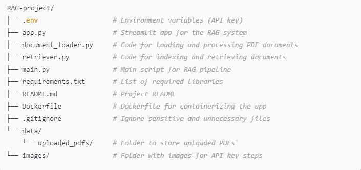

## The README file provides an overview, setup instructions, and images for obtaining the OpenAI API key.

# EzioDevIo RAG Project

This project is a Retrieval-Augmented Generation (RAG) system that allows users to upload PDF documents and ask questions about the content, with responses generated using OpenAI's GPT model.

## Features

- Upload PDF files and retrieve information from them.
- Ask questions based on the uploaded documents.
- Responses are generated in real-time using OpenAI’s `gpt-3.5-turbo` model.

## Setup Instructions

### Prerequisites

- Python 3.8+
- OpenAI API Key (instructions below on how to obtain one)
- Docker (optional for containerization)

### Installation

1. **Clone the repository**:
   ```bash
   git clone https://github.com/EzioDEVio/RAG-project.git
   cd RAG-project

2. **Create and activate a virtual environment**:

```bash
python -m venv venv
source venv/bin/activate  # On Windows, use `venv\Scripts\activate`
```



1. **Install required packages**:

pip install -r requirements.txt


4. **Set up environment variables**:

Create a .env file in the root of your project:
```bash
OPENAI_API_KEY=your_openai_api_key_here
```

5. **Get your OpenAI API Key**:

Go to OpenAI API and create an API key.
Save this key in the .env file as shown above.

6. **Run the Application**:

```bash
streamlit run app.py
```
or 
```bash
python -m streamlit run app.py
```

The app will start on http://localhost:8501.

## Docker Instructions
1. **Build the Docker Image**:

```bash
docker build -t ezio_rag_app .
```
2. **Run the Docker Container**:

```bash
docker run -p 8501:8501 --env-file .env ezio_rag_app
```
> 💡 **Tip:** You can make notes more noticeable with emojis.

If you'd like to pass the API key directly as an environment variable when running the Docker container, you can omit the --env-file .env option and instead use the -e flag to specify the API key directly. Here’s how you can do it:

```bash
docker run -p 8501:8501 -e OPENAI_API_KEY=your_openai_api_key_here ezio_rag_app
```


> 🔥 **Important:** Don't forget to check your configuration settings!

**Ensure that .env is listed in .gitignore to avoid exposing the API key in the repository**.
**The app uses Streamlit for the UI and OpenAI for text generation**.


## Python
venv/ pycache/

## Environment variables
.env

## Streamlit cache
.streamlit/

## Docker
*.dockerignore


